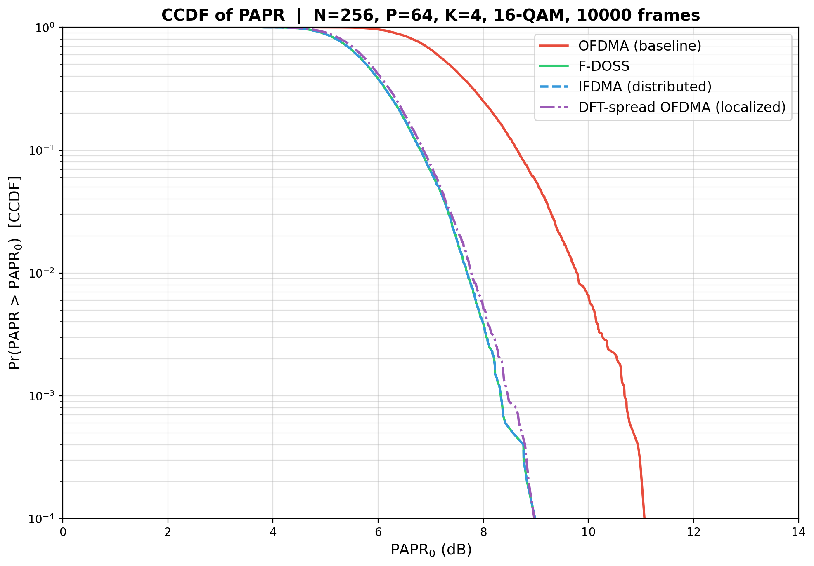

# PAPR Comparison — Hardware-Centric Analysis

## Simulation Results



| Scheme | Mean PAPR | 99th Percentile | Relative to OFDMA |
|---|---|---|---|
| **OFDMA (baseline)** | 7.43 dB | 9.79 dB | — |
| **F-DOSS** | 5.83 dB | 7.69 dB | **−2.1 dB** |
| **IFDMA (distributed)** | 5.83 dB | 7.69 dB | **−2.1 dB** |
| **DFT-spread OFDMA (localized)** | 5.91 dB | 7.77 dB | **−2.0 dB** |

> [!IMPORTANT]
> All three GMC schemes achieve ~2 dB PAPR reduction over baseline OFDMA at the 99th percentile — this translates directly to PA and DAC savings at the handset.

---

## What the CCDF Plot Tells Us

The CCDF curve `Pr(PAPR > PAPR₀)` is the probability that a random OFDM frame exceeds a threshold `PAPR₀`. Reading the plot:

1. **OFDMA (red)** — Rightmost curve. At CCDF = 10⁻², PAPR ≈ 10 dB. This is the worst case because each subcarrier carries an independent QAM symbol, and the N-point IFFT sums them all. With 64 active subcarriers, the Central Limit Theorem makes the time-domain signal approximately Gaussian, creating occasional tall peaks.

2. **F-DOSS (green) & IFDMA (blue, dashed)** — Nearly identical, overlapping curves shifted ~2 dB left. At CCDF = 10⁻², PAPR ≈ 8 dB. F-DOSS achieves this by **skipping the N-point IFFT entirely** — it repeats P QAM symbols K times in the time domain, so the signal has a periodic, single-carrier-like structure. IFDMA achieves the same result via a different path (DFT precoding + distributed subcarrier mapping), which mathematically produces an equivalent time-domain waveform.

3. **DFT-spread OFDMA (purple, dash-dot)** — Very close to F-DOSS/IFDMA but with a slight rightward shift (~0.1 dB). The DFT precoding reduces PAPR similarly, but the **localized** (contiguous) subcarrier mapping doesn't benefit from the same periodic structure as interleaved mapping, causing marginally higher peaks.

---

## Hardware Impact — Why 2 dB Matters

Think of PAPR not as a "communications metric" but as a **constraint on your analog front-end and digital power budget**. Here's the translation:

### 1. Power Amplifier (PA) Back-off & Linearity

| Parameter | OFDMA (10 dB PAPR) | GMC Schemes (~8 dB PAPR) |
|---|---|---|
| Required PA input back-off (IBO) | ~10 dB | ~8 dB |
| PA operating point | Deep class-AB / class-A | Closer to saturation |
| **PA power efficiency** | **~5–10%** | **~15–20%** |

A PA must remain linear up to the peak. With 10 dB PAPR, the PA's average operating point is 10× below its saturation power — wasting >90% as heat. Reducing PAPR by 2 dB lets you operate 1.6× closer to saturation, directly improving drain efficiency. In a handset, this is the difference between a 1W and a 0.6W PA for the same average output.

### 2. DAC Dynamic Range

The DAC must resolve both the average signal and the peak without clipping:

- **OFDMA**: Needs ≥10 dB headroom → requires ~2 extra bits of DAC resolution (each bit ≈ 6 dB)
- **GMC schemes**: ~8 dB headroom → save ~1 bit of resolution

In practical terms: a 10-bit DAC at 100 MSPS can be replaced by a 9-bit DAC, reducing die area, power, and INL/DNL calibration complexity. For an ASIC designer, this is a direct area/power trade.

### 3. Digital Timing & Computational Complexity

| Scheme | Key Operations | Complexity (per user) | Critical Path |
|---|---|---|---|
| OFDMA | N-pt IFFT | O(N log N) | Butterfly stages |
| F-DOSS | Repeat + phase mult | O(N) — **no FFT** | Single multiplier |
| IFDMA | P-pt DFT + N-pt IFFT | O(P log P + N log N) | Two FFT blocks in series |
| DFT-s-OFDMA | P-pt DFT + N-pt IFFT | O(P log P + N log N) | Two FFT blocks in series |

- **F-DOSS** is the clear winner for the transmitter datapath — no FFT engine required. The hardware is a simple register file (store P symbols), a counter (for repetition), and a CORDIC or LUT for the phase ramp. This fits easily in a low-gate-count ASIC.
- **IFDMA / DFT-s-OFDMA** need **two** FFT engines (P-pt + N-pt) cascaded. The P-pt DFT feeds into a subcarrier mapper (essentially a MUX + zero-insertion), then the N-pt IFFT. The critical path is longer, and the pipeline needs careful retiming between stages. However, the total complexity is still manageable since P << N.

---

## The Fundamental Tradeoff (PDF page 10)

```
                        Flexibility
                            ▲
          DFT-s-OFDMA  ●    │    ● OFDMA
          (any P of N)       │    (any P of N)
                             │
          IFDMA  ●           │
          (distributed,      │
           K-spaced)         │
                             │
          F-DOSS  ●          │
          (K-spaced ONLY)    │
                             └──────────────────► PAPR
                           Low                   High
```

| | F-DOSS | IFDMA | DFT-s-OFDMA | OFDMA |
|---|---|---|---|---|
| **PAPR** | ★★★★★ | ★★★★★ | ★★★★☆ | ★★☆☆☆ |
| **Subcarrier flexibility** | ★☆☆☆☆ | ★★★☆☆ | ★★★★★ | ★★★★★ |
| **Tx HW complexity** | ★★★★★ | ★★★☆☆ | ★★★☆☆ | ★★★★☆ |
| **Freq. diversity** | ★★★★★ | ★★★★★ | ★★☆☆☆ | ★★☆☆☆ |

> [!NOTE]
> **Why LTE chose DFT-spread OFDMA for uplink (PDF p.7):** It hits the sweet spot — PAPR nearly as low as F-DOSS (~2 dB better than OFDMA), with full subcarrier allocation flexibility (any P contiguous carriers can be assigned to any user by the scheduler). The localized mapping also enables channel-dependent scheduling, which interleaved/distributed schemes cannot exploit as effectively.

---

## File Locations

- **Simulation script**: [papr_simulation.py](file:///c:/Users/nitro/OneDrive/Desktop/IIT%20Madras/Study%20Resources/Semester%208/EE5141%20-%20Wireless%20and%20Cellular/Mini%20Project/papr_simulation.py)
- **CCDF plot**: [papr_ccdf_comparison.png](file:///c:/Users/nitro/OneDrive/Desktop/IIT%20Madras/Study%20Resources/Semester%208/EE5141%20-%20Wireless%20and%20Cellular/Mini%20Project/papr_ccdf_comparison.png)
